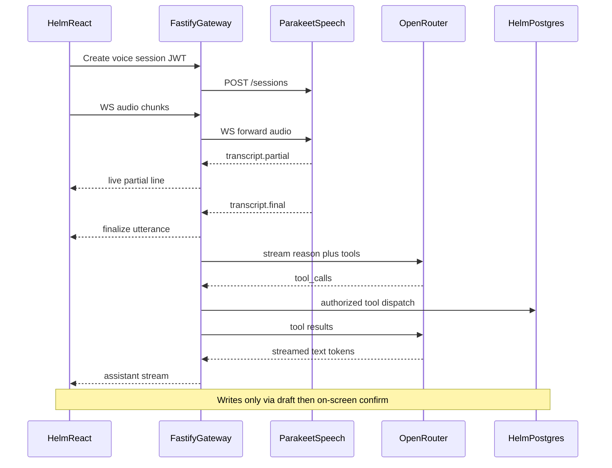

# Streaming Voice Assistant — Repository and Feasibility Assessment (Loop 0)

**Status:** Loops 0–10 implemented in-repo (2026-07-18). Feature remains **disabled by default**.  
**Date:** 2026-07-18  
**Stack decision:** Parakeet Unified EN 0.6B (streaming STT) + OpenRouter (reasoning/tools). **Do not use OpenAI Realtime or an OpenAI API key.**

**Pilot status:** `NOT READY` for production pilot until Parakeet GPU `/readyz` is verified on the target host and an operator completes [`voice-assistant-live-evaluation.md`](voice-assistant-live-evaluation.md). Local/CI path uses `SPEECH_ENGINE=fake` + `AI_REASONING_PROVIDER=fake`.

---

## 1. Purpose

Assess whether Helm can host a secure voice assistant that:

1. Captures microphone audio in the browser.
2. Streams audio through an authenticated Helm API gateway.
3. Produces **live partial transcripts** while the user speaks (Parakeet).
4. On end-of-turn, sends only the **finalized** utterance to OpenRouter for reasoning and approved Helm tool calls.
5. Streams the assistant text response back to the UI.
6. Requires on-screen confirmation before any Helm mutation.

This document records repository integration points, hardware feasibility, architecture, security boundaries, risks, and the adjusted implementation loop plan.

---

## 2. Existing Helm integration points

### 2.1 Repository layout

| Path | Role |
|------|------|
| `apps/web` | React 19 + Vite + Mantine SPA (default Vite port **5174**) |
| `apps/api` | Fastify + Prisma + PostgreSQL |
| `apps/forge-worker` | Host OS Forge build worker (unrelated to voice) |
| `packages/types` | Shared roles/DTOs |
| `deploy/` | Production compose and env templates |
| `docs/ai-assist.md` | Existing Workspace AI contract |
| `services/` | **Does not exist yet** — Loop 1 creates `services/speech` |

### 2.2 Authentication and authorization

| Piece | Location | Notes |
|-------|----------|-------|
| JWT sign/verify | `apps/api/src/auth.ts` | HS256; Bearer required on protected routes |
| Login | `apps/api/src/routes/authLogin.ts` | Public |
| Protected plugin | `apps/api/src/index.ts` | `preValidation: authMiddleware` for `/api/*` (except public routes) |
| DB user resolve | `apps/api/src/userService.ts` (`requireDbUser`) | JWT subject → Prisma `User` |
| Frontend token | `apps/web/src/auth/authToken.ts`, `AuthContext.tsx` | `localStorage` JWT |

**Roles** (`User.role` string): `lead` | `assistant` | `member` | `forge_mobile_lead`  
Typed helpers: `packages/types/src/forge.ts`, `packages/types/src/catalog/index.ts`.

**Voice access (planned):** `lead` and `assistant` (core Helm users). Forge-only tools remain behind `canAccessForge`. Do not grant voice session creation to anonymous users.

### 2.3 Existing AI / assistant code

| Layer | Path |
|-------|------|
| Doc | `docs/ai-assist.md` |
| LLM client | `apps/api/src/llm/openaiCompatible.ts` (OpenAI-compatible `/v1/chat/completions`) |
| Providers | OpenRouter, LM Studio, Ollama, mock — `providerPresets.ts` |
| Ask Helm tools | `apps/api/src/llm/chatTools.ts` — `search_triage`, `get_standup`, `search_planning`, `search_decisions`, `search_catalog_gaps`, `get_morning_brief`, `get_blocker_radar` |
| Assist routes | `apps/api/src/routes/assist.ts` |
| Staged writes | Prisma `AiActionProposal` + `apps/api/src/routes/aiProposals.ts` |
| Daily cap | `apps/api/src/llm/usageGuard.ts` (in-process) |
| Secret at rest | Encrypted workspace key via `HELM_SECRET_ENCRYPTION_KEY` |
| UI | `/apps/ai`, `/apps/ai/chat`, `/apps/ai/review` |

**Important:** Workspace AI is **text chat completions only**. There is no speech, WebRTC, WebSocket audio, or OpenAI Realtime usage today.

Voice will use **server-side OpenRouter** for reasoning, independent of the Workspace AI enable flag (`LlmWorkspaceSettings.enabled`). Prefer dedicated voice budget env vars so voice cannot silently exhaust the Workspace AI daily cap without operator intent. Existing `OPENROUTER_API_KEY` seed (`seedOpenRouterFromEnv.ts`) may supply a key for local bootstrap, but voice must remain controllable via `VOICE_ASSISTANT_ENABLED=false` by default.

### 2.4 Domain services useful for tools

| Domain | Routes / services | Auth pattern |
|--------|-------------------|--------------|
| Dashboard | `routes/dashboardOverview.ts` | JWT + `requireDbUser` |
| Triage | `routes/triage.ts` (fat routes) | JWT; ClickUp mutations lead-only |
| Standup | `routes/standup.ts`, `standup/helpers.ts` | JWT; upsert current user |
| Planning | `routes/planning.ts` | JWT |
| Decisions | `routes/decisions.ts` | JWT |
| Catalog | `catalog/services/*`, `catalog/authz.ts` | Read: catalog access; write: lead |
| Forge | `forge/services/*`, `forge/authz.ts` | `lead` or `forge_mobile_lead` |
| Search | `routes/search.ts` | JWT |

**Ghost API:** `get_release_milestones` / release-milestones routes appear in docs but are **not implemented** in TypeScript. Omit from the v1 voice tool list.

**Draft/confirm patterns to reuse:**

1. `AiActionProposal` approve/reject (lead) — strongest confirm gate.
2. Assist drafts that do not persist until the user/proposal applies.
3. Catalog/ClickUp preview → commit flows.

### 2.5 Frontend API-client patterns

| Piece | Path |
|-------|------|
| Fetch + Bearer | `apps/web/src/apiClient.ts` (`apiFetch`) |
| Hook wrapper | `apps/web/src/useApi.ts` |
| TanStack Query | `main.tsx` QueryClient |
| Vite proxy | `/api` → API; **120s** timeout for slow LLMs |

Voice UI should live under `apps/web/src/features/voice/` (or equivalent). WebSocket auth will use the same JWT (query param or first-message auth — decide in Loop 2; prefer header-compatible patterns where the browser allows).

### 2.6 Streaming patterns today

| Finding | Implication |
|---------|-------------|
| No `@fastify/websocket` dependency | Greenfield WebSocket gateway in Loop 2 |
| `docs/domain-and-tls.md`: “WebSocket not required for core Helm” | Voice adds an explicit WS requirement for `/api/ai/voice/*` |
| No SSE audio streaming | Not a substitute for bidirectional audio chunks |

### 2.7 Audit, logging, rate limiting

| Mechanism | Location |
|-----------|----------|
| Global rate limit | `@fastify/rate-limit` in `index.ts` (`RATE_LIMIT_MAX`) |
| Request id | `x-request-id` |
| Helmet | CSP disabled on API |
| `AuditEvent` | Prisma — used by catalog/ClickUp; extend for voice session/tool/draft events |
| Observability | `docs/observability.md` — health endpoints; OTel backlog |

### 2.8 Tests

| Area | Stack |
|------|-------|
| API unit | Node.js built-in test runner + `tsx` (`apps/api` `*.test.ts`) |
| Web unit | **None** today — introduce Vitest in Loop 3 |
| E2E | PowerShell smoke scripts; **no Playwright** — add in Loop 8 |
| LLM mock | `HELM_LLM_MOCK` / mock provider |

### 2.9 Docker, deploy, browser constraints

| Config | Notes |
|--------|-------|
| `docker-compose.yml` | postgres, api, web; Mailpit profile `forge-dev` |
| `deploy/compose.production.yml` | LAN ports; CORS; secrets via env |
| Web nginx | `apps/web/nginx/default.conf` |
| **Permissions-Policy** | `location=(), microphone=(), geolocation=()` — **blocks browser mic** until changed |
| HTTPS / localhost | Required for `getUserMedia` outside secure contexts |
| Reverse proxy | Must support WebSocket upgrade for voice paths (Loop 10) |

---

## 3. Hardware and GPU feasibility

Assessed on the primary Helm development host (2026-07-18).

| Check | Result |
|-------|--------|
| Host GPU | **NVIDIA GeForce RTX 4070 Laptop GPU** |
| Driver | **581.29** |
| VRAM | **8188 MiB** |
| Docker NVIDIA runtime | Present (`Runtimes` includes `nvidia`) |
| Container GPU smoke | `nvidia/cuda:12.4.0-base-ubuntu22.04` pulled; in-container `nvidia-smi` CSV returned header only — **treat Docker GPU passthrough as needing an explicit Loop 1 readiness test** (common WSL2/Docker Desktop quirk) |
| Host Python | **3.14.0b4** (beta) — **do not** rely on host Python for production speech; pin **3.10–3.12** inside the speech container |
| Target model | `nvidia/parakeet-unified-en-0.6b` (Hugging Face) — English RNN-T; offline + buffered streaming via NeMo |
| NeMo caveat | Community reports load failures on NeMo **2.7.3**; pin a known-good NeMo / main-compatible version in Loop 1 |
| VRAM estimate | Comparable Parakeet 0.6B streaming footprints are ~3 GB class → **1–few concurrent sessions** on 8 GB is plausible; large concurrency is not |
| Language | **English only** for this STT configuration |

### Verdict

| Environment | Feasibility |
|-------------|-------------|
| This laptop (dev) | **Feasible** for controlled Parakeet pilot if Docker GPU passthrough is verified |
| Host without NVIDIA GPU | **Not feasible** for Parakeet GPU path — use `SpeechProvider` substitute (see §5) |
| Production LAN host | Re-run GPU + NVIDIA Container Toolkit checks before enabling the voice compose profile |

**Arabic and Libyan Arabic are not supported** by Parakeet Unified EN 0.6B. Do not claim dialect quality for this configuration. Mixed Arabic/English speech will degrade or fail transcription.

---

## 4. Selected architecture and rationale

### 4.1 Why not OpenAI Realtime

Product decision: keep speech local (Parakeet) and reasoning on OpenRouter already used by Helm. Avoid a second permanent cloud voice vendor key and WebRTC peer path to OpenAI.

### 4.2 Target flow

```text
Browser microphone
        ↓ streamed audio chunks
Helm Fastify API (JWT gateway)
        ↓
Parakeet streaming transcription (services/speech)
        ↓ partial and final transcripts
Browser live transcript panel
        ↓ finalized utterance only
OpenRouter reasoning model (server-side)
        ↓ controlled tool calls
Helm domain services and PostgreSQL
        ↓
Streamed assistant text response
```

Optional spoken TTS is a later provider hook — not required for Loops 1–8.

### 4.3 Sequence



### 4.4 Locked decisions

| Decision | Choice |
|----------|--------|
| STT process | Separate Python service `services/speech` — never load Parakeet inside Node |
| Browser → speech | **Never direct**; only `WS /api/ai/voice/sessions/:sessionId` (or equivalent authenticated streaming) |
| Reasoning | `ReasoningProvider.stream` with OpenRouter first |
| Live UX | Partial transcript **replaces** current line by `sequence`; finals append to history |
| OpenRouter timing | Only **finalized** utterances (+ manual Send now) |
| Writes | Draft → on-screen confirm → re-auth → exactly once (`AiActionProposal` preferred) |
| Feature flag | `VOICE_ASSISTANT_ENABLED=false` by default |
| Client-supplied model/URL | Forbidden |
| Ghost tool | Omit `get_release_milestones` |

### 4.5 Planned speech-service endpoints

| Method | Path | Purpose |
|--------|------|---------|
| GET | `/healthz` | Liveness |
| GET | `/readyz` | Model loaded and GPU/runtime OK |
| POST | `/sessions` | Create transcription session (called by API only) |
| WS | `/sessions/:sessionId/audio` | Audio in; transcript events out |
| DELETE | `/sessions/:sessionId` | Cancel / cleanup |

Typed events (minimum):

```json
{ "type": "transcript.partial", "text": "Review today's standups", "sequence": 12 }
{ "type": "transcript.final", "text": "Review today's standups and identify blocked projects.", "sequence": 18 }
```

Include session id, timestamps, and confidence when the engine provides them.

### 4.6 Planned env (Loop 1+)

```env
VOICE_ASSISTANT_ENABLED=false
SPEECH_PROVIDER=parakeet
PARAKEET_MODEL=nvidia/parakeet-unified-en-0.6b
SPEECH_SERVICE_URL=http://speech:8000
OPENROUTER_API_KEY=
OPENROUTER_DEFAULT_MODEL=
OPENROUTER_DEEP_MODEL=
AI_REASONING_PROVIDER=openrouter
AI_MAX_INPUT_TOKENS=
AI_MAX_OUTPUT_TOKENS=
AI_REQUEST_TIMEOUT_MS=
AI_DAILY_BUDGET_USD=
```

Validate with Zod in `apps/api/src/env.ts`. Never expose these to `VITE_*` or the browser bundle.

---

## 5. SpeechProvider substitution strategy

If the target host has no compatible NVIDIA GPU, Docker GPU fails, or Parakeet cannot load:

```ts
interface SpeechProvider {
  createSession(meta: SpeechSessionMeta): Promise<{ sessionId: string }>;
  connectAudio(sessionId: string): AsyncDuplex; // audio chunks in, transcript events out
  closeSession(sessionId: string): Promise<void>;
  readiness(): Promise<{ ready: boolean; detail: string }>;
}
```

| Provider id | When to use |
|-------------|-------------|
| `parakeet` | Default when GPU + NeMo ready (`SPEECH_PROVIDER=parakeet`) |
| `fake` | CI / deterministic E2E (Loop 8) — emits scripted partial then final events |
| Future `cloud_asr` / CPU engine | Only if product later approves an alternate English streaming ASR; same event contract |

Helm API selects the provider from server config. The controller UI never chooses a speech URL or model name.

**Graceful degradation:** If speech is unavailable, Helm core and Workspace AI text features remain up; voice UI shows a clear “Voice unavailable” state. If OpenRouter is unavailable, live transcription may still work while reasoning fails with a recoverable error.

---

## 6. Security boundary

| Rule | Enforcement |
|------|-------------|
| No permanent LLM keys in React, `VITE_*`, logs, or source maps | Server-only env / encrypted storage |
| Browser never reaches `SPEECH_SERVICE_URL` | Network: speech bound to Docker internal network; API is the only client |
| JWT on session create and WS | Fastify auth middleware + session ownership checks |
| No arbitrary SQL / HTTP tools | Allowlisted dispatcher with Zod I/O |
| No fabricated facts | Prompt: tool-before-claim; only return tool data |
| Mutations | Immutable draft + on-screen confirm; voice “yes” alone is insufficient for high-impact actions |
| No raw audio persistence by default | Speech service memory-only buffers; retention policy later if transcripts stored |
| Audit | Session start/end, tool calls, draft confirm/cancel via `AuditEvent` |
| Rate / concurrency / budget | Per-user session limits + `AI_DAILY_BUDGET_USD` |
| Kill switch | `VOICE_ASSISTANT_ENABLED=false` |

Prompt-injection defense: treat ClickUp titles, repo READMEs, and email bodies as untrusted tool *data*, not instructions. Redact secrets from tool outputs before sending to OpenRouter.

---

## 7. Known limitations and risks

| Item | Detail |
|------|--------|
| English-only STT | Arabic / Libyan Arabic unsupported in this configuration |
| 8 GB laptop VRAM | Cap concurrent Parakeet sessions (e.g. 1–2) |
| Docker GPU on Windows | Must pass `/readyz` with real device visibility before pilot |
| NeMo version pin | Parakeet Unified load is version-sensitive |
| No existing WS stack | New Fastify + nginx/proxy configuration surface |
| Nginx mic block | Must update `Permissions-Policy` for production web image |
| End-of-turn | Hybrid silence threshold + Send now + Cancel required for reliable UX |
| Cost | OpenRouter billed per reasoning turn; STT local (GPU power/time) |
| No TTS in v1 | Assistant replies as streamed text unless a later TTS provider is added |
| Two-person team | Design for lead + assistant, not org-wide concurrency |

---

## 8. Estimated cost and capacity model

| Component | Cost driver | Notes |
|-----------|-------------|-------|
| Parakeet | GPU electricity / occupancy | No per-token STT bill; concurrency limited by VRAM |
| OpenRouter | Tokens per finalized turn + tool loops | Use `OPENROUTER_DEFAULT_MODEL` for normal turns; optional `OPENROUTER_DEEP_MODEL` for complex analysis |
| Budget | `AI_DAILY_BUDGET_USD` | Hard stop when exhausted; clear UI message |

Do not invent production WER or latency numbers before Loop 9 live evaluation.

---

## 9. Adjusted implementation loop plan

| Loop | Scope | Exit focus |
|------|--------|------------|
| **0** | This assessment | Runtime understood; no code |
| **1** | `services/speech` Parakeet service (health, sessions, WS audio, partial/final, pytest) | Model loads; `/readyz`; fake/GPU modes |
| **2** | Fastify voice gateway (auth WS proxy, ownership, rate limits) | Browser never hits Python; tests with mock speech |
| **3** | React live transcription UI + state machine + Vitest | Partials update while speaking; mic cleanup |
| **4** | End-of-turn detection (silence, Send now, Cancel) | Only finals → reasoning |
| **5** | `ReasoningProvider` + OpenRouter streaming | Streamed assistant text; budgets |
| **6** | Read-only Helm tools (Zod, authz, audit) | No SQL escape; omit release-milestones |
| **7** | Draft/confirm writes via `AiActionProposal` | Exactly-once; on-screen confirm |
| **8** | Fake speech + fake OpenRouter + Playwright E2E | **Multiple partial states visible before final** |
| **9** | Opt-in live Parakeet/OpenRouter evaluation | English-only disclaimer; metrics |
| **10** | Compose GPU profile, docs, health, rollout, degradation | Pilot-ready or NOT READY |

Suggested speech compose profile name: `voice` (GPU-enabled `speech` service).

Final program status language (Loop 10 closure): only  
`READY FOR CONTROLLED INTERNAL PILOT` or `NOT READY`.

---

## 10. Loop 0 exit criteria checklist

| Criterion | Met |
|-----------|-----|
| Repository architecture documented | Yes (§2) |
| Hardware / NVIDIA / Docker findings documented | Yes (§3) |
| Parakeet feasibility and English-only limit stated | Yes (§3) |
| `SpeechProvider` substitution planned | Yes (§5) |
| Architecture without OpenAI Realtime locked | Yes (§4) |
| Security boundary defined | Yes (§6) |
| Browser never connects to Python service (design) | Yes (§4, §6) |
| Subsequent loops adjusted to Helm reality | Yes (§9) |
| No implementation code in Loop 0 | Yes |

**Loop 0 complete.** Proceed to Loop 1 only after review of this document.
