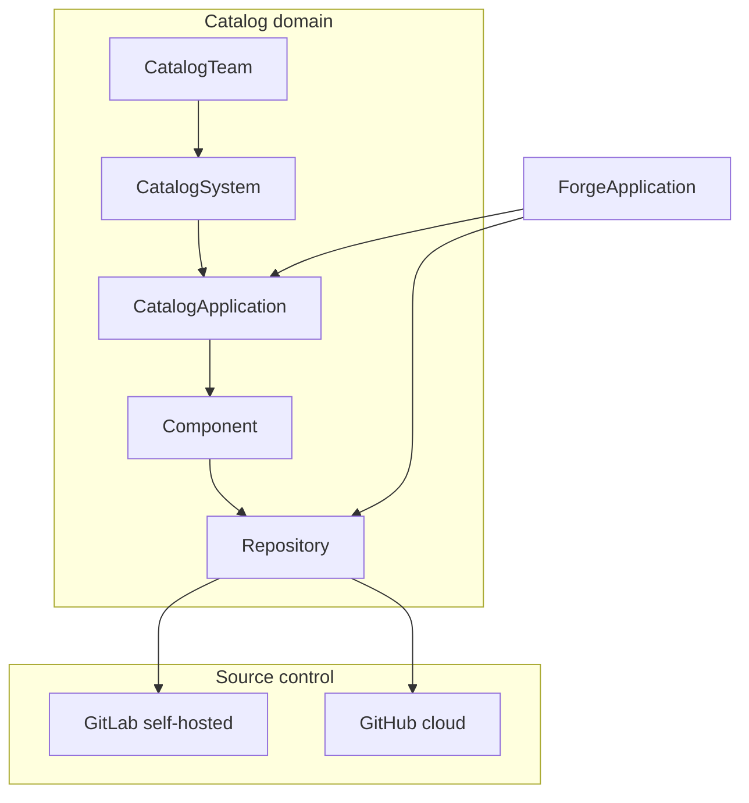

# Engineering Catalog

Provider-neutral repository intelligence for Helm: teams, systems, applications, components, repositories, pipelines, quality signals, and Forge integration.

## Connections

| Connection slug | Provider | Typical use |
|-----------------|----------|-------------|
| `gitlab-internal` | GitLab self-hosted | Legacy backend / internal namespaces |
| `github-cloud` | GitHub.com | MITF portfolio repos (e.g. wallet-services) |

Configure via environment — see [ENVIRONMENT.md](../ENVIRONMENT.md#engineering-catalog).

## Inventory import

Place spreadsheets under `apps/api/data/catalog-imports/`:

- `backend.xlsx` (~42 repos)
- `mobile.xlsx` (~20 apps)
- `web.xlsx` (4 repos)

JSON fixtures (`*.fixture.json`) ship for dev when Excel files are absent. Blank spreadsheet cells map to **`unknown`**, not `false` or `no`.

## Architecture

## Origin migration

Repositories keep a stable catalog `id`. Use **Change origin** on the repository detail page to move between GitHub cloud and self-hosted GitLab (or reverse). Prior origins are stored in `RepositoryOriginHistory`; Forge `repositoryUrl` updates on cutover.

## Related docs

- [import-mapping.md](./import-mapping.md)
- [provider-matrix.md](./provider-matrix.md)
- [assessment-loop0.md](./assessment-loop0.md)
