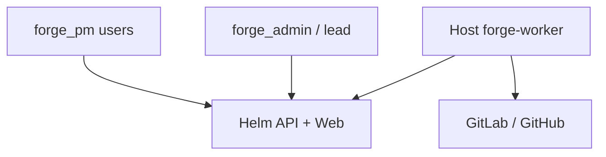

# Forge — system context

Forge inside Helm connects **project managers**, **forge administrators**, and **host build workers** for demo Flutter mobile builds across Masarat bank applications.

See [system-context diagram](./system-context.md) in prior standalone draft — stakeholders: PMs, admins, mobile devs (profile config), workers, security/compliance.

**In scope:** Build automation for existing Flutter repos via approved branches, flavors, and profiles.

**Out of scope (MVP):** AI-generated screens, TestFlight, Firebase App Distribution.

