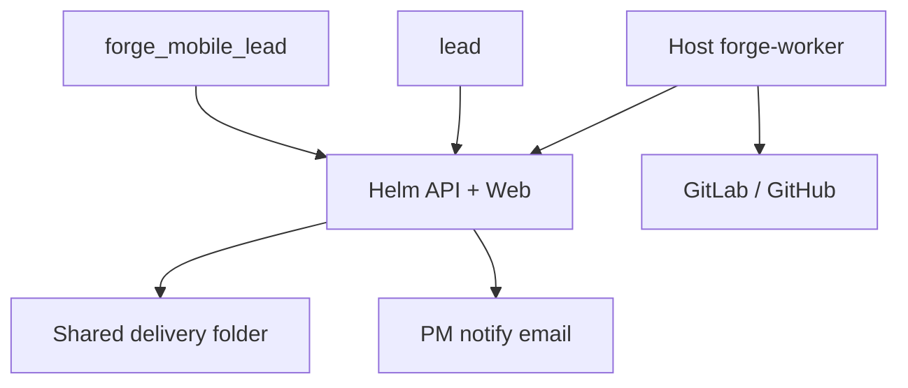

# Forge — system context

Forge inside Helm connects the **mobile team lead**, Helm **lead**, **host build workers**, and a **shared delivery folder** for PM handoff (no PM Helm login).

**In scope:** Build automation for existing Flutter repos via approved branches, flavors, and profiles; opt-in copy of APKs to a bank/app shared folder with email notify.

**Out of scope (MVP):** AI-generated screens, TestFlight, Firebase App Distribution, emailing APK attachments.

