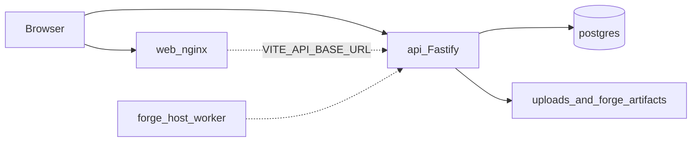

# Production readiness assessment — Helm (dev-office-assistance)

**Date:** 2026-07-18  
**Target:** Masarat LAN server `10.100.235.21` (shared with OmniTest Studio)  
**Status:** Assessment complete — implementation follows this inventory.

---

## Current architecture

Helm is an npm-workspaces monorepo (`office-assistance`):

| Path | Role |
|------|------|
| `apps/api` | Fastify API, Prisma/PostgreSQL, JWT+MFA auth, in-process schedulers (catalog, ClickUp, Microsoft To Do) |
| `apps/web` | React 19 + Vite + Mantine SPA; production image served by nginx |
| `apps/forge-worker` | Host-OS Flutter build worker (bootstrap only; **not** Docker) |
| `packages/types` | Shared TypeScript types |

---

## Services that must be deployed (LAN v1)

| Service | Image / runtime | Host port | Container port |
|---------|-----------------|-----------|----------------|
| `web` | `anstwechy/dev-office-assistance-web` | **46810** | 80 |
| `api` | `anstwechy/dev-office-assistance-api` | **46811** | 4000 |
| `postgres` | `postgres:16-alpine` | **not published** | 5432 |
| `migrate` | same API image, one-shot | — | — |

**Not deployed in Compose:** Forge host worker, Mailpit, Redis, RabbitMQ, reverse proxy (deferred).

---

## Shared server inventory (vs OmniTest)

| Item | OmniTest | Helm |
|------|----------|------|
| Host | `10.100.235.21` | same |
| SSH | `masarat-admin@10.100.235.21` | same |
| Compose dir | `~/compose-omnitest-studio` | `~/compose-dev-office-assistance` |
| Web | 46300 | **46810** |
| API | 46400 | **46811** |
| Postgres host | 46432 | **none (internal)** |
| Redis | 46380 | n/a |
| Registry | `qamasarat/omnitest-*` | `anstwechy/dev-office-assistance-*` |

**Port collision risk:** none if Helm stays on 46810/46811.

---

## Required infrastructure

- Linux Docker Engine + Compose plugin on `10.100.235.21`
- Docker Hub pull access for `anstwechy/*`
- Named volumes: Postgres data, uploads, forge artifacts
- Disk for images + volumes (coexists with OmniTest under `/var/lib/docker`)
- Optional: SMTP, GitLab/GitHub tokens, ClickUp, M365 app IDs

---

## Runtime dependencies

| Dependency | Required | Notes |
|------------|----------|-------|
| Node 20+ (build) / Node 22 Alpine (images) | Yes | CI uses 20; Dockerfiles use 22 |
| PostgreSQL 16 | Yes | Prisma migrations |
| Redis / broker | No | Schedulers run in API process |
| Object storage | No | Local disk volumes |
| SMTP | Optional | Invites / Forge notifications |
| GitLab `10.10.20.51` | Optional | Engineering catalog |
| GitHub API | Optional | Catalog |
| ClickUp / Graph | Optional | Apps integrations |

---

## Background workers / scheduled jobs

Inside API process (`setInterval`):

- Catalog sync (`CATALOG_SYNC_*`)
- ClickUp sync (`CLICKUP_SYNC_*`)
- Microsoft To Do sync (`MICROSOFT_TODO_SYNC_*`)

Cron HTTP: weekly digest (documented `CRON_SECRET`).

---

## Authentication

- Local JWT (`jose`) + bcrypt passwords + TOTP MFA
- Seed users for local/dev only — **must not auto-seed in production**
- Optional MSAL in browser for Graph pages only

---

## Configuration

- Loaded via Zod in `apps/api/src/env.ts` from root `.env`
- Web: `VITE_API_BASE_URL` baked at image build
- Gaps: production can fall back to localhost CORS; GitLab default `http://10.10.20.51`; weak JWT placeholders in examples

---

## Existing Docker / Compose / CI

| Artifact | Finding |
|----------|---------|
| `apps/api/Dockerfile` | Single-stage, root, migrates on start |
| `apps/web/Dockerfile` | Multi-stage nginx; often `localhost:4000` API URL |
| `docker-compose.yml` | Local prod-like; publishes Postgres; weak DB password |
| `docker-compose.server.yml` | LAN ports OK; local images; auto-seed; hardcoded DB password |
| `.github/workflows/ci.yml` | Build/lint/unit only |
| `.github/workflows/docker-hub.yml` | Push short SHA + latest on `main` |

---

## Health / migrations / tests

- Health: `/healthz` only (no readiness)
- Migrations: Prisma `migrate deploy`; currently in API CMD and server overlay
- Tests: API unit tests (`npm run test`); Forge/list smoke PowerShell scripts
- No `tests/smoke/` production suite yet

---

## Environment variable inventory (consumers)

See `docs/configuration.md` (created in Loop 2). Core required in production:

- `DATABASE_URL`, `AUTH_JWT_SECRET` (≥32), `CORS_ORIGIN` (must include LAN web origin), `NODE_ENV=production`
- Deploy: `IMAGE_TAG`, `REGISTRY_NAMESPACE`, `POSTGRES_*`
- Optional secrets: SMTP, catalog/ClickUp encryption keys and tokens, `CRON_SECRET`, `FORGE_RUNNER_TOKEN_PEPPER`

---

## Volumes / paths

| Volume / path | Purpose |
|---------------|---------|
| Postgres named volume | DB data |
| `/app/data/uploads` | Triage/expense attachments |
| Forge artifacts/workspaces roots | Build artifacts (API + future host worker) |

---

## Missing production components

1. Live/ready health + graceful shutdown  
2. Production fail-fast config  
3. Multi-stage non-root API image (no migrate-in-CMD)  
4. Registry-based LAN Compose under `deploy/`  
5. Dedicated migrate one-shot  
6. Paramiko deploy script + LAN runbooks (OmniTest pattern)  
7. Backup/restore/rollback docs + scripts  
8. Smoke tests  
9. Stronger CI (compose validate, image digests, audit)  
10. Security/observability checklists  

---

## Risk summary

| Category | Risks |
|----------|--------|
| Security | Hardcoded `postgres/postgres`; seed on server start; root containers; CORS localhost defaults; tokens in env without encryption key |
| Reliability | Migrate-on-start race; no readiness; no graceful shutdown; in-process cron duplicates if scaled |
| Deployment | Local-only server images; no Paramiko path; web baked with wrong API URL |
| Data loss | No backup runbook; uploads only on volume if compose defines it |
| Configuration | Silent dev defaults in production |

---

## Items that block production

- Registry-based compose + secrets not hardcoded  
- No auto-seed on deploy  
- Health readiness + migrate one-shot  
- Documented LAN deploy (probe → pull → migrate → up → smoke)  
- Strong `AUTH_JWT_SECRET` + LAN `CORS_ORIGIN` / `VITE_API_BASE_URL`  

## Items that can be postponed

- Public TLS / reverse proxy  
- Dedicated `deploy` SSH user / `/opt` layout  
- Separate compose GitHub repo  
- Forge worker packaging  
- OTel / HA API replicas / object storage  

---

## Recommended implementation order

1. Assessment (this doc)  
2. Code hardening + health  
3. Configuration templates  
4. Dockerfiles + LAN compose  
5. Migrate/backup/rollback  
6. Paramiko + on-server scripts + smoke  
7. CI / Docker Hub tags  
8. Runbooks + final report  

Aligned with OmniTest: **probe → publish images → upgrade → smoke → rollback via previous IMAGE_TAG**.
